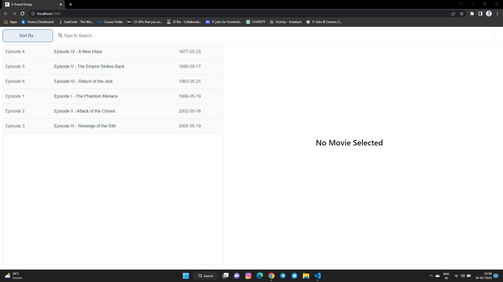
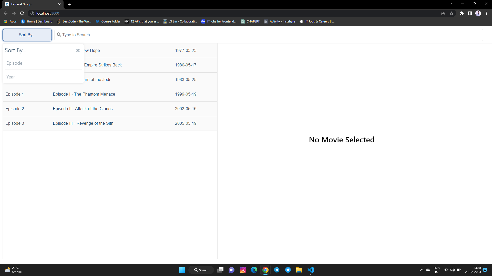
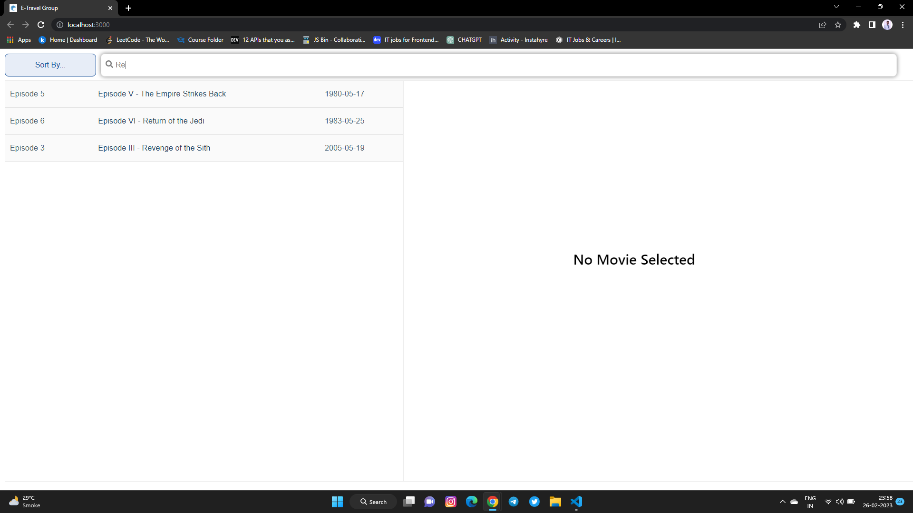
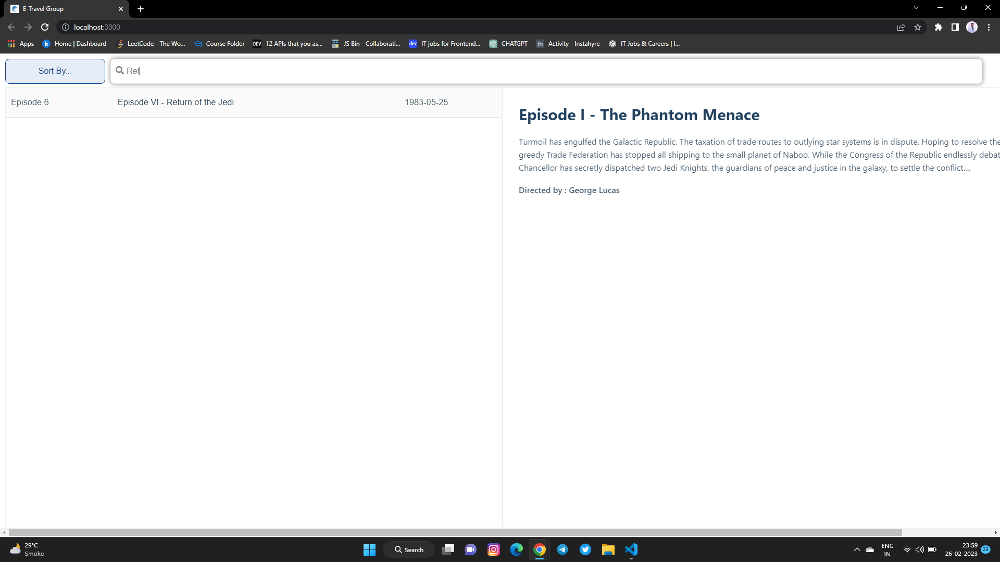
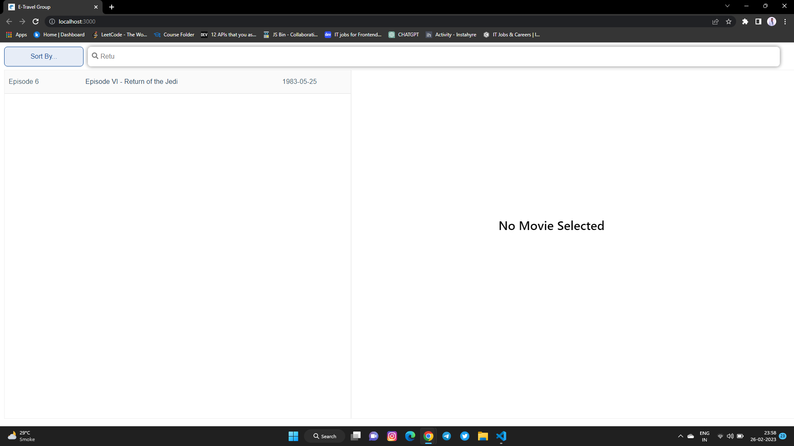
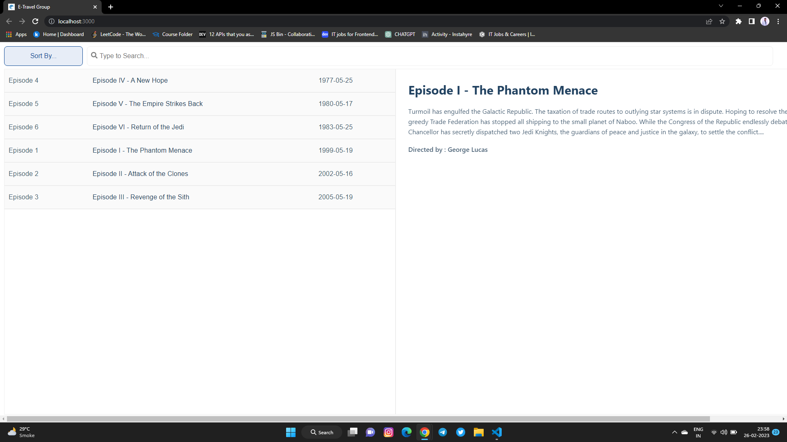
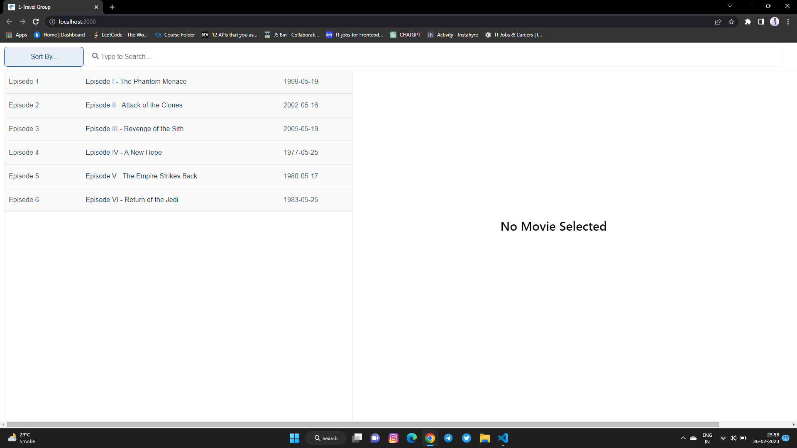
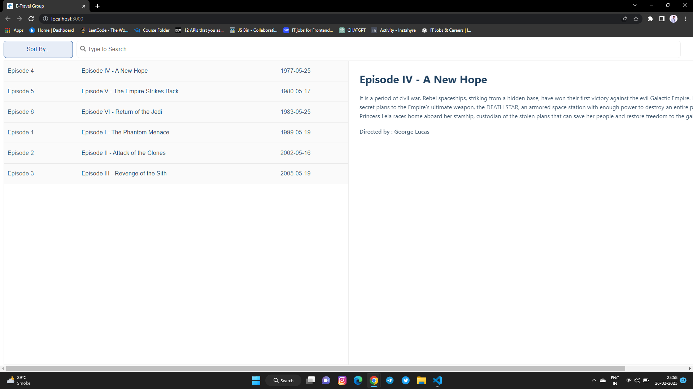

# eTravel-assignment
A React Application to display movie list

To Clone the Repository 
https://github.com/Harshsanas/eTravel-assignment.git

npm install to install node manager packages.

When no movie selected

Sorting Features

Search Features

Selected Movie

Sorting Feature in ascending order Episode 

Sorting Feature in ascending order Year 

